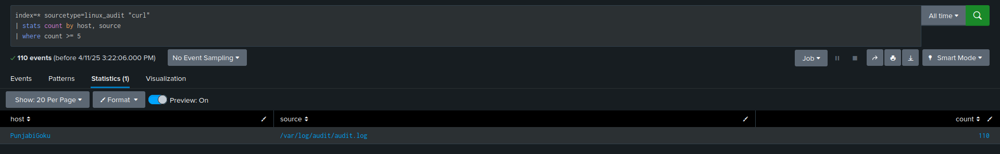
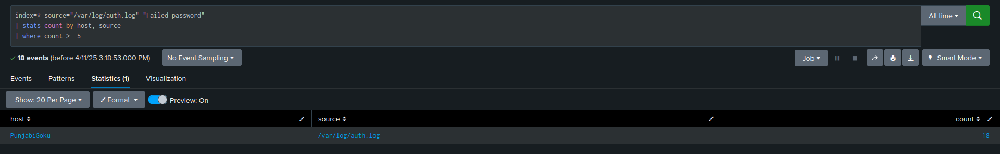

#  T1071.001 – Application Layer Protocol Detection (curl)

### Step summary:
The screenshot below shows the output of a Splunk SPL query that detects command-line usage of the curl command in my Linux audit logs. The query index=* sourcetype=linux_audit "curl" filters logs using the linux_audit sourcetype and searches for the keyword "curl". The results are grouped by host (which shows my system name PunjabiGoku) and source (which points to /var/log/audit/audit.log). The output confirms that my host generated 110 matching events, indicating repeated usage of the curl command — consistent with MITRE ATT&CK technique T1071.001 (Application Layer Protocol).

# T1110.001 – Brute Force Detection (SSH)
### Step summary:
The screenshot below shows the output of a Splunk SPL query used to detect brute force login attempts on a Linux system. The query searches for the phrase "Failed password" in /var/log/auth.log, then groups the results by host and source, and filters for cases where the count is 5 or more. In this case, the host PunjabiGoku triggered 18 failed SSH login attempts from /var/log/auth.log, matching the behavior of MITRE ATT&CK technique T1110.001 (Brute Force).

