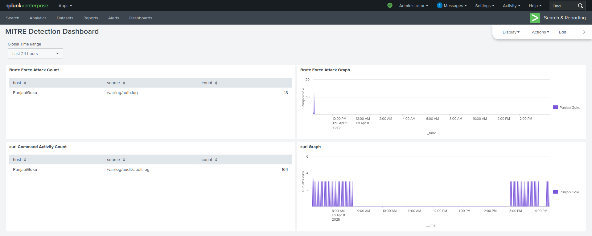

# Step 5 – MITRE Detection Dashboard

## Objective:
I created this Splunk dashboard to visually track and display the simulated attack activity from earlier steps. The main focus is on two MITRE ATT&CK techniques — one for brute force SSH login attempts and the other for detecting curl command usage (which mimics command and control traffic). This makes it easier to quickly see when and how those attacks were happening.

---

## T1110.001 – Brute Force (SSH Login Failures)

This panel pulls in data from `/var/log/auth.log` and shows how many failed SSH login attempts occurred. It gives a count of events from my host `PunjabiGoku` and also includes a time-based graph to show when those login failures happened over time. This

