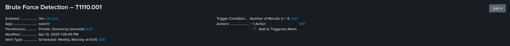
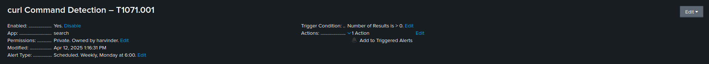

###– Brute Force Detection (T1110.001)

This screenshot shows the final configuration of the brute force alert in Splunk. It confirms that the alert is:
- Enabled and running
- Triggering when **number of results is > 5**
- Scheduled appropriately
- Logged to the Triggered Alerts dashboard

This proves that the SPL logic was operationalized into an active detection rule.

### curl Command Detection (T1071.001)

This screenshot shows the curl alert configuration in Splunk. It monitors for command-line activity involving `curl` from the `linux_audit` logs, mapped to **MITRE ATT&CK T1071.001 (Application Layer Protocol)**.

The alert is scheduled, actively enabled, and triggers whenever any curl command usage is detected within the last 5 minutes.

