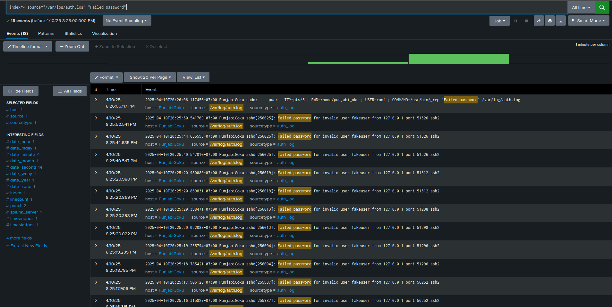
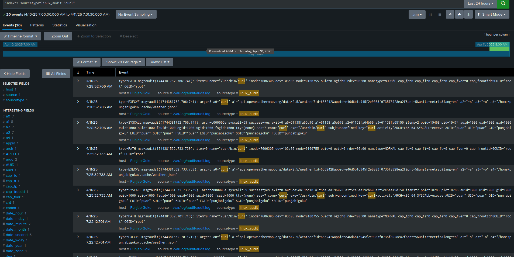

## Step 3 – Simulated Attacks: Brute Force (T1110.001) + HTTP (T1071.001)


### Objective:
Simulate a brute force attack on a Linux system and verify that the resulting failed SSH login attempts are captured and ingested into Splunk for detection.

---

### What Was Done:

1. Installed and started SSH server:
   ```bash
   sudo apt update
   sudo apt install openssh-server -y
   sudo systemctl enable ssh
   sudo systemctl start ssh
2. Simulated brute force attack
3. ```bash
   for i in {1..10}; do ssh fakeuser@localhost; done
4. Verified logs in Linux terminal
5. ```bash
   sudo grep "Failed password" /var/log/auth.log
6.Added /var/log/auth.log to Splunk

7.Verified in Splunk using:
### Screenshot – Brute Force Logs in Splunk  



## MITRE T1071.001 – Application Layer Protocol (HTTP)

### Objective:
Simulate HTTP-based command and control behavior using the curl command to trigger logs for detection.

---


### What Was Done:

1. Enabled auditd logging for curl:
   ```bash
   sudo auditctl -w /usr/bin/curl -p x -k curl-activity
2. Simulated activity:
   ```bash
   curl http://example.com/test

   
3. Verified logs written to auditd
   ```bash
    sudo ausearch -k curl-activity
   
4. Confirmed Splunk ingestion
(run this in Splunk's Search & Reporting app)
 <pre> ```bash
    index=* sourcetype=linux_audit "curl  <pre> </pre>

---
###  Curl Execution in Splunk:

